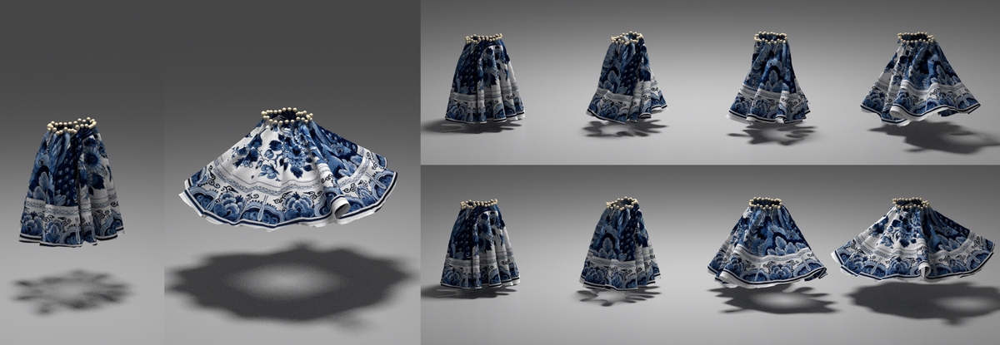

# DiffCloth

Customized by V-Sekai

Code repository for our paper [DiffCloth: Differentiable Cloth Simulation with Dry Frictional Contact](https://people.csail.mit.edu/liyifei/publication/diffcloth-differentiable-cloth-simulator/)


[📃 Paper](https://people.csail.mit.edu/liyifei/uploads/diffcloth-highres-tog.pdf) | [🌍 Project](https://people.csail.mit.edu/liyifei/publication/diffcloth/)

### Tested Operating Systems

Ubuntu 22.04 | Mac OS 12

### 1. Download the repo:

### 2. Build CPP code with Cmake:

From the top directory:

```
mkdir build
cd build
cmake ..
make
```

### 3. Optimize/Visualize Section 6 Experiments:

- Run optimization:

  ```
  ./DiffCloth -demo {demooptions} -mode optimize -seed {randseed}
  ```

  where `{demooptions}` is the name of the demos from the following options and `{randseed}` is an integer for random initialization of the initial guesses
  of the tasks.

  The corresponding option for each of the experiments is:

  - T-shirt: `tshirt`
  - Sphere: `sphere`
  - Hat: `hat`
  - Sock: `sock`
  - Dress: `dress`

- Visualize optimization iters:

  ```
  ./DiffCloth -demo {demooptions} -mode visualize -exp {expName}
  ```

The progress of the optimization is saved into the `output/` directory of the root folder.

### Note

Feel free to contact me at liyifei@csail.mit.edu or create a Github issue if you have questions regarding setting up the repository, running examples or adding new examples.

### Citation

Please consider citing our paper if your find our research or this codebase helpful:

    @article{Li2022diffcloth,
    author = {Li, Yifei and Du, Tao and Wu, Kui and Xu, Jie and Matusik, Wojciech},
    title = {DiffCloth: Differentiable Cloth Simulation with Dry Frictional Contact},
    year = {2022},
    issue_date = {February 2023},
    publisher = {Association for Computing Machinery},
    address = {New York, NY, USA},
    volume = {42},
    number = {1},
    issn = {0730-0301},
    url = {https://doi.org/10.1145/3527660},
    doi = {10.1145/3527660},
    abstract = {Cloth simulation has wide applications in computer animation, garment design, and robot-assisted dressing. This work presents a differentiable cloth simulator whose additional gradient information facilitates cloth-related applications. Our differentiable simulator extends a state-of-the-art cloth simulator based on Projective Dynamics (PD) and with dry frictional contact&nbsp;[Ly et&nbsp;al. 2020]. We draw inspiration from previous work&nbsp;[Du et&nbsp;al. 2021] to propose a fast and novel method for deriving gradients in PD-based cloth simulation with dry frictional contact. Furthermore, we conduct a comprehensive analysis and evaluation of the usefulness of gradients in contact-rich cloth simulation. Finally, we demonstrate the efficacy of our simulator in a number of downstream applications, including system identification, trajectory optimization for assisted dressing, closed-loop control, inverse design, and real-to-sim transfer. We observe a substantial speedup obtained from using our gradient information in solving most of these applications.},
    journal = {ACM Trans. Graph.},
    month = {oct},
    articleno = {2},
    numpages = {20},
    keywords = {differentiable simulation, cloth simulation, Projective Dynamics}
    }
